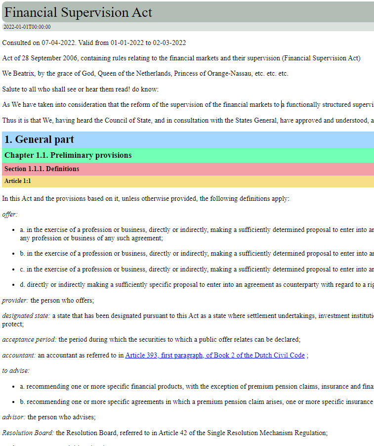

# Spider Ease
- This project is a web scraping CLI application using `Node.js` and `Puppeteer`
- The scraper service (`scraper`) will scrape the given page via the JS template available in the `lib` folder

## Installation
- Step1: Install the `NodeJS`(version 16.+ or latest)
- Step2: Install the VSCode (latest version)
- Step3: Required node modules have been installed in the project. Use the below command to import node packages

```
npm install
```
## Features
### V1 (additions)
- Run the `JS` scrapers to perform rule base HTML simplification to match the universal `C#` template
- Run the `JS` simplification both offline and online modes with local cache
- Browser-level debugging ability to put the breakpoints on actual eval functions
- Tryout the code in the browser developer console before creating the `JS` template
- Run the full pipeline if required at the end (`JS Conversion` + `Universal Template Caller` + `Spidering Output`)
- JS templates are located in the `lib` folder with the SP code standard. Example: `.\lib\_CA--STATCAN--REG--ADMIN-DATA.js`

### V2 (additions)
- Automatic DOM relocation
- Automatic removal of hidden content
- Automatic arrangement of transform/non-heading parts
- Removing the requirement of correcting the image links and anchor links as those will be the same as the original because we are not recreating the HTML
- No need to build the transform/non-heading parts. You just have to wrap the main content area & headings/levels in the original HTML
- No need to create content comparison tests as we are not recreating the HTML but instead modifying the original
- If no `JS` template is found for SP code, then it will by default call the `DOM-RELOCATOR.js`. Expecting the incoming HTML is already wrapped outside to the spider ease project. One user is the chrome plugin input

## Version History
- `V1`: initial version (deprecated), it's about recreating the HTML to match the ease standard
- `V2`: Supported from `2022-JUL-15` onwards, it's about relocating the original HTML to match the ease standard
 
## Usage

### 1. To run the scraper service for the single-page books

Command:
```
npm run scraper -- --sp='<STARTPOINT>' --url='<URL>' --path='<DOWNLOAD_PATH>'
```

Example:
```
npm run scraper -- --sp='CA--STATCAN--REG--ADMIN-DATA' --url='https://www.statcan.gc.ca/eng/about/policy/admin_data' --path='C:\Users\dinusha.ambagahawita\Downloads'
```

Tests Cases: It's mandatory to pass `ALL` these tests for each template which will ensure valid root scopes are used for tests, valid level order is created, valid image paths exist, valid anchor paths exist, and no content is missing between 2 HTML files.
```
[TEST]:single root test - success!
[TEST]:single root test - success!
[TEST]:root exists test - success!
[TEST]:root level test - success!
[TEST]:root level test - success!
[TEST]:content exists test - success!
[TEST]:content level test - success!
[TEST]:level text test - success!
[TEST]:level order test - success!
[TEST]:image path test - success!
[TEST]:anchor path test - success!

[LEVEL SUMMARY] ease-root count:1
[LEVEL SUMMARY] ease-content count:1
[LEVEL SUMMARY] issue-date count:1
[LEVEL SUMMARY] level1 count:1
[LEVEL SUMMARY] level2 count:12
```

Download Folder:
```
.\downloads\CA--STATCAN--REG--ADMIN-DATA\
```

Download Files:
```
.\downloads\CA--STATCAN--REG--ADMIN-DATA\cccf739ae90f8a898e62c13c28b630d9db4bc6d1_original.html
.\downloads\CA--STATCAN--REG--ADMIN-DATA\cccf739ae90f8a898e62c13c28b630d9db4bc6d1.html
```

- `cccf739ae90f8a898e62c13c28b630d9db4bc6d1_original.html` original HTML file downloaded with URL `SHA-1` filename

- `cccf739ae90f8a898e62c13c28b630d9db4bc6d1.html` recreated HTML file matching with URL `SHA-1` filename

### 2. To run the entire spidering pipeline in local which does the below steps
- Clear output folder
- Run spider ease
- Run spider prepare
- Run spider template

Command:
```
bash run.sh '<STARTPOINT>' '<URL>' '<OUTPUT_FOLDER>' '<SPIDER_EASE_HOME>' '<SPIDER_TEMPLATE_HOME>' 'COMMANDS'
```

Example:
```
bash run.sh 'CA--STATCAN--REG--ADMIN-DATA' 'https://www.statcan.gc.ca/eng/about/policy/admin_data' 'C:\Users\dinusha.ambagahawita\Downloads' 'C:\Users\dinusha.ambagahawita\projects\spider.ease' 'C:\Users\dinusha.ambagahawita\projects\spider.templates' 'CLEAR|EASE|PREPARE|SPIDER'
```
## HTML Wrapping Standard

### Top Level
- Main Root information => `<div class='ease-root'></div>`

- Main Content information => `<div class='ease-content'></div>`

### Sub Level
- Root title => `<div class='level1'></div>`

- Root Issue date => `<div class='issue-date'></div>`

- Root Effective date => `<div class='effective-date'></div>`

- Content Levels 2-10 => `<div class='level2'></div>`, `<div class='level3'></div>`, `<div class='level4'></div>`, `<div class='level5'></div>`, `<div class='level6'></div>`, `<div class='level7'></div>`, `<div class='level8'></div>`, `<div class='level9'></div>`, `<div class='level0'></div>`

- Content Footnotes => `<div class='footnote'></div>`

### Level Alias (optional:to be deprecated)
- Additional level title aliases if required =>  `<div class='level-alias1'></div>`, `<div class='level-alias2'></div>`, `<div class='level-alias3'></div>`, `<div class='level-alias4'></div>`, `<div class='level-alias5'></div>`, `<div class='level-alias6'></div>`, `<div class='level-alias7'></div>`, `<div class='level-alias8'></div>`, `<div class='level-alias9'></div>`

---
Style Guide:

---
Example:

---

## Technologies Used


## FAQs
---
(Q) Unable to run the run scraper command in the readme?

(A) Check the NodeJS version whether it has the latest or given in the readme

---
(Q) VS code basic debug points are not working?

(A) Enable the VS Code auto to attach the debugger
Press: `CTRL+SHIFT+P` => select `Debug: Toggle Auto Attach` => select `Always`

---
(Q) Puppeteer browser debug points are not working?

(A) Enable the dev tools parameter in the code
`devtools: true`

---

## References
[Public Tutorial Reference](https://www.digitalocean.com/community/tutorials/how-to-scrape-a-website-using-node-js-and-puppeteer)